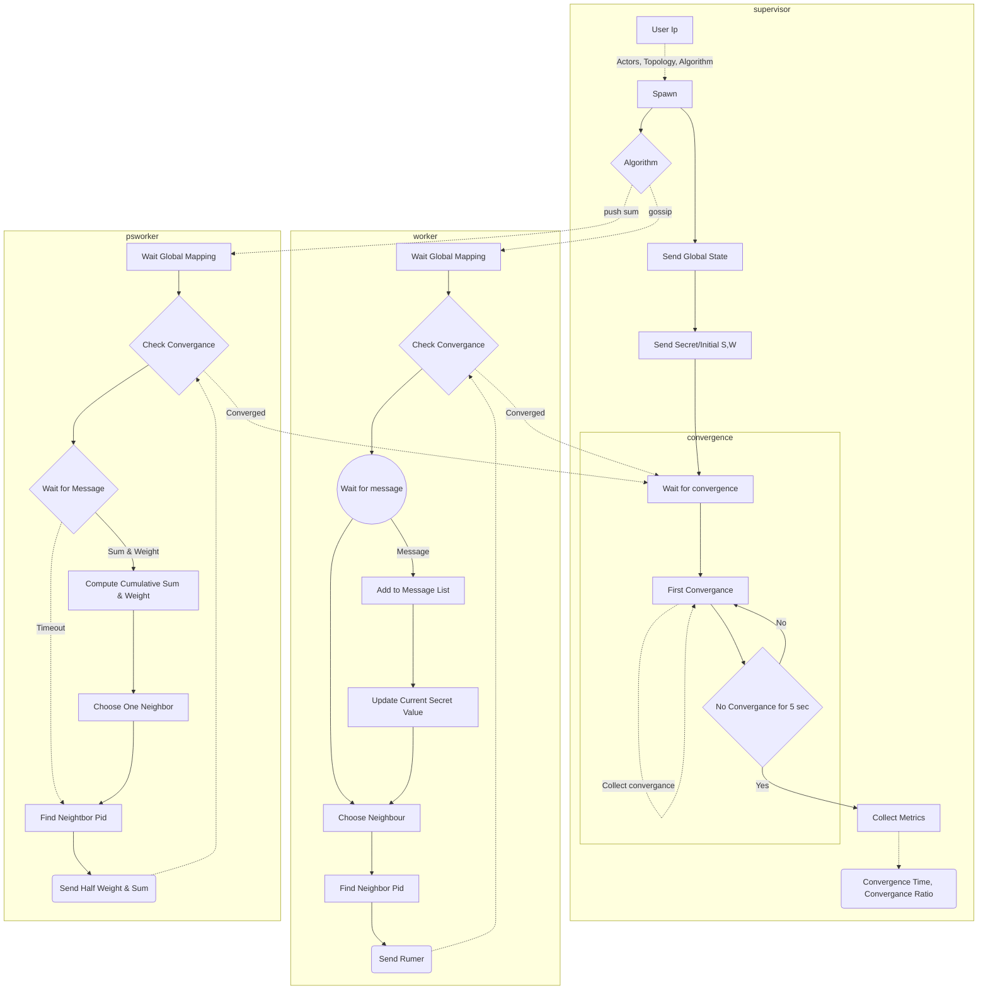
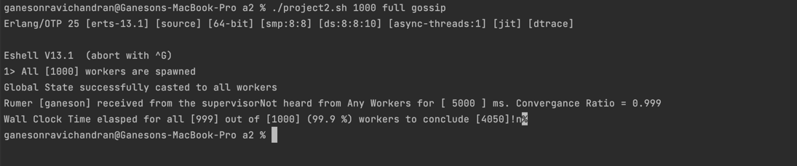

## Erlang Bitcoin Mining Simulation.

This is the actor model based bitcoin mining system in erlang submitted in response
to [project 1](https://ufl.instructure.com/courses/467300/assignments/5383669)
of [COP5615](https://ufl.instructure.com/courses/467300).

#### Team

| Name                     | Gator Email             | UF Id     | Github username |
|--------------------------|-------------------------|-----------|-----------------|
| Ravichandran, Ganeson    | g.ravichandran@ufl.edu  | 10798982 | GANES1998       |
| Munaga, Sai Pavan Kalyan | saipavank.munaga@ufl.edu | 88769245 | saipavankalyan  |

#### Architecture



#### Steps of Execution

1. Fill the [variables.env](variables.env) with appropriate values.

   | Variable Name         | Use                                                                                       |
   |-----------------------|-------------------------------------------------------------------------------------------|
   | CONVERGE_LENGTH       | Defaults to 5 for push sum and 10 for gossip                                              |
   | ERLANG_BIN            | Absolute path to erlang bin.                                                              |

2. Execute ```./project2.sh ActorCount Topology Algorithm``` where
      * ActorCount - Number of Actors - For 2d topologies, the nearest perfect square is taken
      * Topology - one of 
        * full - Star chosen at random
        * line - position + or - 1 if possible
        * twoD - one of all 8 possible neighbours of a position in a 2D grid.
        * twoDImperfect - twoD plus another node chosen at random.
      * Algorithm
        * push_sum
        * gossip




#### Answers

*2. What is working*

- Gossip
  - All four topologies are working upto 20K processes and 99+% of the actors are converging
- Push Sum.
  - All four topologies are working upto 5K processes and 99+% of the actors are converging.

*3. What is the largest network you managed to deal with for each type of topology and algorithm?*

| Algorithm | Topology      | Largest Network |
|-----------|---------------|-----------------|
| Gossip    | full          | 20K             |
| Gossip    | line          | 20K             |
| Gossip    | twoD          | 25K             |
| Gossip    | twoDImperfect | 25K             |
| Push Sum  | full          | 5K              |
| Push Sum  | line          | 5K              |
| Push Sum  | twoD          | 5K              |
| Push Sum  | twoDImperfect | 5K              |


