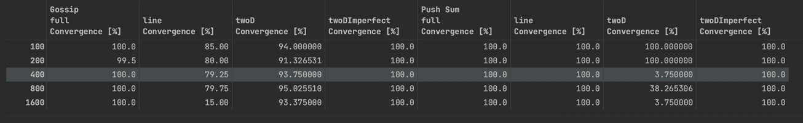
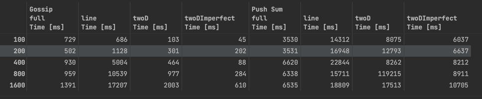
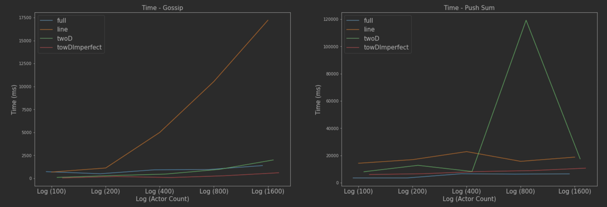

<h2 style="text-align:center">Project Report</h2>

**Group Member**
1. Ganeson Ravichandran, g.ravichandran@ufl.edu
2. Sai Pavan Kalyan Munaga, saipavank.munaga@ufl.edu

Implementation Details:

*Gossip*

    1. Each Gossip Actor coninuously sends its message to choosen random worker.
    2. When it receives a message from other worker, considers it as its secret message and updates it to its seen list
    3. When any actor receives same secret for 10 times, It 

*Push Sum*

    1. When a actor doesn't see any change in Sum / Weight beyond 10^-10 for consecutive 3 times, then we converge the actor.
    2. We terminate the actor, after all nodes in the network terminate.

This report is generated from running the script [reports.sh](report.sh) and storing the output in [reports.out](report.out).
The result is then parsed through python notebook [plots.ipynb](plots.ipynb) to obtain the shown data frame and plots.

**Plots**

**Convergence**

**Observation**

- In both algorithms, Full and twoD imperfect has full convergence. All actors receive the message or sum.
- This implies, random sause added to the topology, helps in better spread of message.
- Line performs the worst and this is expected considering the very restrictive constraint line has. It can choose one from at most 2 options
- The lesser the constraint in choosing neighbours, more options for choosing and better spread in lesser time. Thus, full performs the best.

**Time**

**Observation**

- In both algorithms, Line take long time to converge. This is because of the constraint line has. It can send message to one of tow neighbouts.
- There is a bump in push sum, twoD which may appear misleading. But, if we correlate this with convergence, the convergence for 400, 1600 for twoD is very low. But for 800 it is high. the code was not able to receive any actors converging for continuous 5 seconds for 400 and 1600 - push sum and hence stopped with very low convergence. But for 800, more actors converged, thus there is a bump in time.
- The lesser the constraint in choosing neighbours, more options for choosing and better spread in lesser time. Thus, full followed by towDImperfect performs the best.

